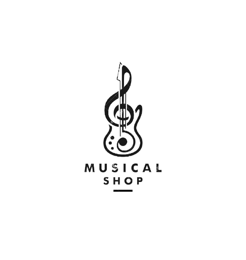

<p align="center">
<a href="https://laravel.com" target="_blank">

</a>
</p>

## Микросервис "Oнлайн магазин музыкальных инструментов"

Микросервис создан для бронирования и приобретения разного вида продуктов. 
Можно смотреть, создавать, изменять, удалять, делать поиск, бронировать, делать покупки, добавлять в избранные продукты. 
Проект можно расширять подключив к нему другие микросервисы и дополнительный функционал.

## Настройки
```
$ git clone https://github.com/K-Gulzada/MusicalInstrumentStore
$ cd musicalInstrumentStore
$ composer install
php artisan serve
```

## Модели и Контроллеры
В проекте 8 моделей, которые отвечают за связь с предметной областью и 9 контроллеров. Контроллер CommonController является абстрактным классом от которого наследуются другие контроллеры и используют общие методы такие как Get, Create, Delete.
Другие контроллеры содержат методы уникальные для каждой модели.

## Функционал
- **Product** (Create, Read, Update, Delete)
- **Category** (Create, Read, Update, Delete)
- **Brand** (Create, Read, Update, Delete)
- **Booking** (Create, Read, Update, Delete)
- **Favorite** (Create, Read, Update, Delete)
- **Status** (Create, Read, Update, Delete)
- **Discount** (Create, Read, Update, Delete)
- **Delivery** (Create, Read, Update, Delete)

## Route
Для выполнения разного рода операции нужно обращаться по правильному route-у. 
- Для получения всех данных о продуктах отправляем **GET** запрос http://127.0.0.1:8000/api/product.
Можно запрашиваемый лист данных отфильтровать, отправив в теле запроса параметры. 
Например ссылка http://127.0.0.1:8000/api/product?product_name=Виолончель вернет нам лист продуктов, 
где название продукта соответствует указанному в теле **GET** запроса.
Пример:
```
[
    {
        "id": 2,
        "category_id": 1,
        "product_name": "Виолончель",
        "description": "В комплекте имеются смычок, струны, канифоль и чехол",
        "price": "411590.00",
        "created_at": "2022-02-08T14:10:29.000000Z",
        "updated_at": "2022-02-08T14:15:35.000000Z",
        "img_path": null,
        "brand_id": null
    },
    {
        "id": 3,
        "category_id": 1,
        "product_name": "Скрипка",
        "description": "В комплекте имеются струны, канифоль и чехол",
        "price": "200590.00",
        "created_at": "2022-02-10T15:23:48.000000Z",
        "updated_at": "2022-02-10T15:23:48.000000Z",
        "img_path": "images/cello.png",
        "brand_id": null
    }
]
```
- Для создания нового объекта сначала указываем что это **POST** запрос и переходим по ссылке http://127.0.0.1:8000/api/product. Тело запроса в json формате. 
Пример:
``` 
    {
          "category_id":1,
          "product_name":"Виолончель",
          "description":"В комплекте имеются смычок, струны, канифоль и чехол",
          "price":"411590.00",
          "img_path":"images/cello.png"    
    }
  ```


При успешном завершении, метод вернет статус **201** и сам объект, который только что был создан.
- Обновление данных уже существующего в базе объекта выполняется **PUT** запрос 
по route http://127.0.0.1:8000/api/product/{id}, где **id** это айди изменяемого объекта.
- При удалении объекта выполняем **DELETE** запрос по route http://127.0.0.1:8000/api/product/{id}, 
где **id** это айди удаляемого объекта.

